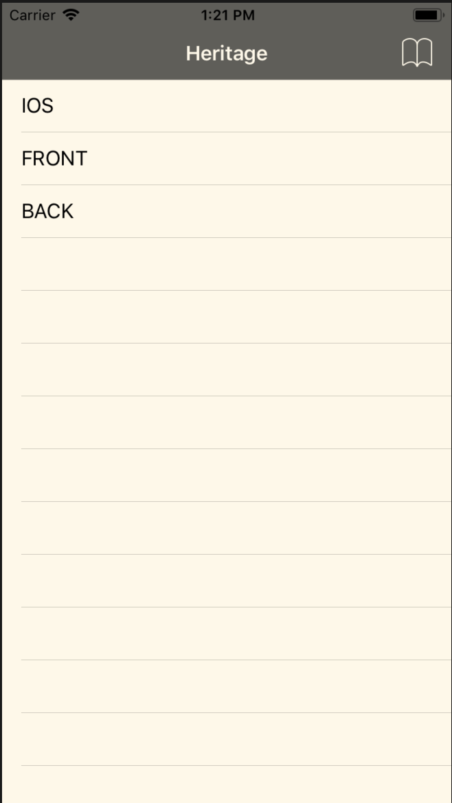
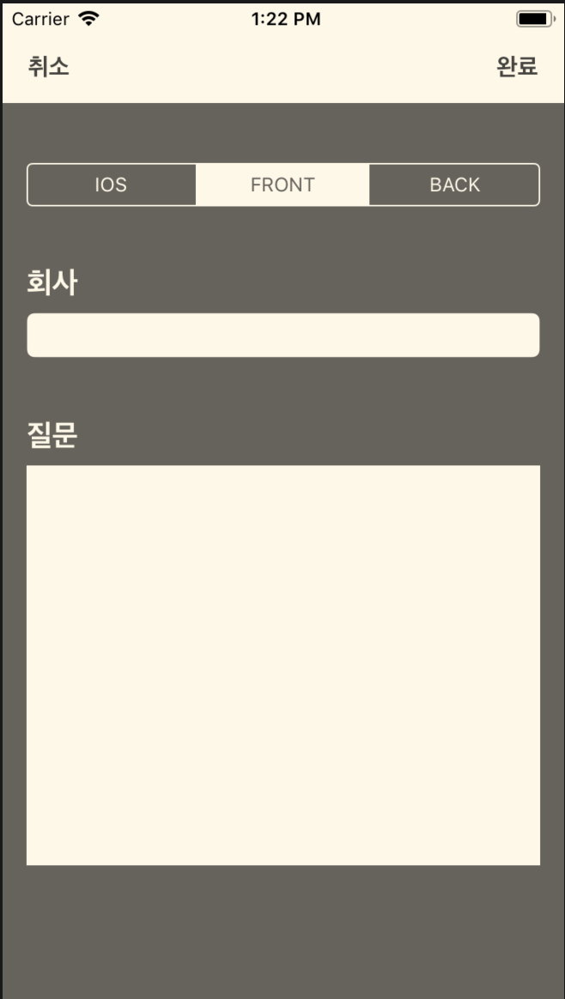
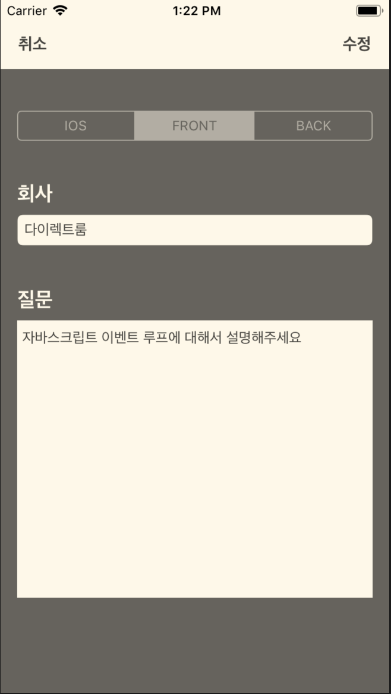
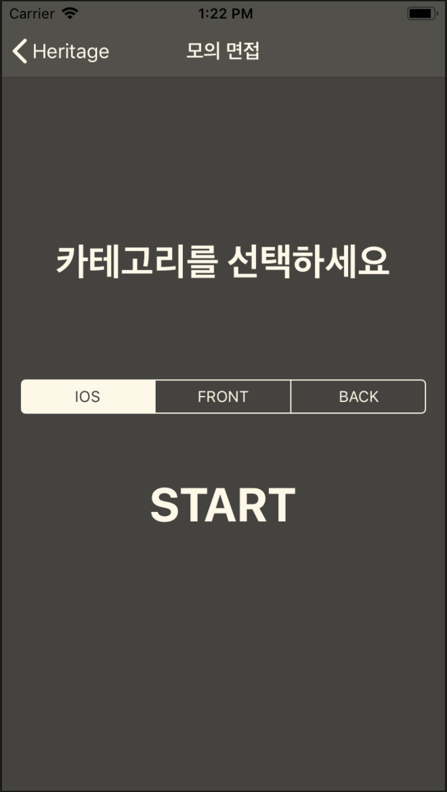
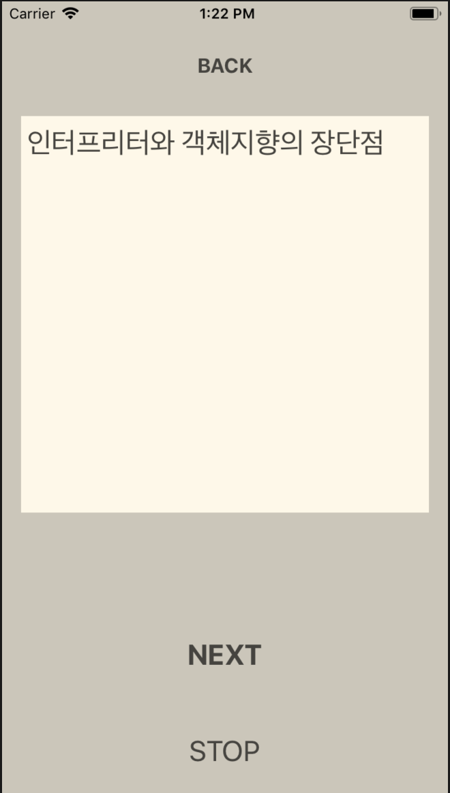

# Heritage

> 코드스쿼드 해커톤 (2019-08-15)

***Heritage*** 는 코드스쿼드의 각 코스(모바일, 프론트, 백엔드) 의 현재 수강생, 졸업생 모두의 집단 지성을 모으기 위한 플랫폼입니다. 각 분야별 면접 질문을 공유하고, 모인 질문을 기반으로 모의 면접을 볼 수도 있습니다.

&nbsp;

## Feature 📝

### 카테고리(코스)별 질문

코스별로 질문 목록을 확인할 수 있습니다.

  

&nbsp;

### 새 질문 등록하기

카테고리별로 질문을 등록할 수 있습니다.

  

&nbsp;

### 질문 상세 & 수정 및 삭제

질문 상세내역을 보고 수정하거나 삭제할 수 있습니다.

  

&nbsp;

### 모의 면접

분야를 선택하면 랜덤으로 10개의 모의 면접 질문을 순차적으로 보여줍니다.

  
  

&nbsp;